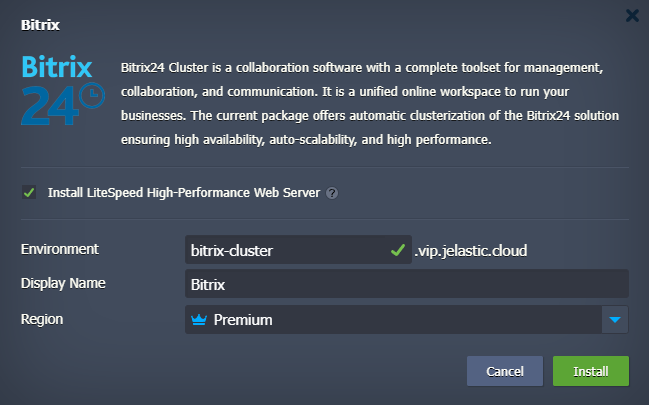
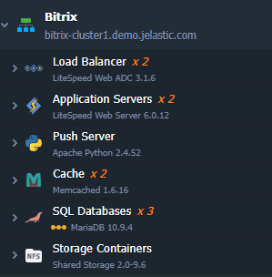

# Highly Available and Auto-Scalable Bitrix24 Cluster
 

Ensuring scalable performance and continuous accessibility is a task that is of highiest importance for any web project. The website of any business should always be available for customers, and the pages of the website should be loaded in the shortest possible time, regardless of factors that may or cannot affect the server.
Bitrix Web Cluster offers an integrated solution that provides easily customizable and flexible scalability and accessibility for the entire web project, and not just a database or web server individually.
Another feature is that Bitrix Web Cluster is extremely attractive to business owners and administrators: web -clasterization is supported at the bitrix architecture level. Web developers should not absolutely not make absolutely changes in the source code of their web projects in order to migrate into the configuration of the cluster.

 

## Cluster Topology

While the JPS installation the following topology will be created:

Where:

 - Either highly available [LiteSpeed ADC](https://www.virtuozzo.com/application-platform-docs/litespeed-web-adc/) or [NGINX load balancer](https://www.virtuozzo.com/application-platform-docs/nginx-load-balancer/) is used for distributing the incoming traffic within a cluster

 - Web Application Firewall will be enabled by the default if LiteSpeed Web Server will be installed

 - The Bitrix24 application itself is handled by either [LiteSpeed Web Server](https://www.virtuozzo.com/application-platform-docs/litespeed-web-server/) or NGINX PHP servers with preconfigured automatic horizontal scaling to handle load spikes

 - [Memecached](https://www.virtuozzo.com/application-platform-docs/memcached/). For centralized and robust cache data storage, the Bitrix solutions takes advantage of the memcached server cluster which is in use by many web projects

 - Highly-available [MariaDB Galera Cluster](https://www.virtuozzo.com/company/blog/master-master-slave-replication-mysql-mariadb-auto-clustering/) is used to store and operate user data. Cluster implements Galera replication topology with synchronous replication between cluster nodes

 - Traffic encryption is provided by [Let's Encrypt Add-On](https://www.virtuozzo.com/company/blog/free-ssl-certificates-with-lets-encrypt/) with automatic issuing of trusted SSL certificate and Auto-Renewal

 - [Premium CDN](https://www.virtuozzo.com/company/blog/free-ssl-certificates-with-lets-encrypt/) integration in order to provide lightning-fast static assets loading
 
 - Push server (pulling server, instant messages server) is designed to quickly exchange messages between users who enter the portal through the browser or are connected using table or mobile applications
 
 - NAS service is implemented via [NFS shared storage](https://www.virtuozzo.com/application-platform-docs/shared-storage-container/) to process file requests from the cluster nodes

## Deployment to the Cloud

To get started, log in to Virtuozzo Application Platform dashboard, import the required manifest using the link from GitHub:
[https://github.com/jelastic-jps/bitrix24-cluster/blob/main/manifest.jps](https://github.com/jelastic-jps/bitrix24-cluster/blob/main/manifest.jps)

In the opened confirmation window, you may untick the **Install LiteSpeed High-Performance Web Server**, thus the NGINX load balancer and NGINX web server will be deployed instead of LiteSpeed stacks.

If required, change the **Environment Name** and destination [Region](https://www.virtuozzo.com/application-platform-docs/environment-regions/).

After successful installation, you’ll receive emails with Bitrix Cluster admin panel URL and database access credentials.
The cluster topology looks like as follows in the platform dashboard.

To bind a custom domain with custom SSL certificate follow the steps described in our [documentation](https://www.virtuozzo.com/application-platform-docs/custom-ssl/) otherwise you can use [Let's Encrypt Free SSL Add-On](https://www.virtuozzo.com/company/blog/free-ssl-certificates-with-lets-encrypt/) automated solution. Install the add-on on the load balancer layer.

